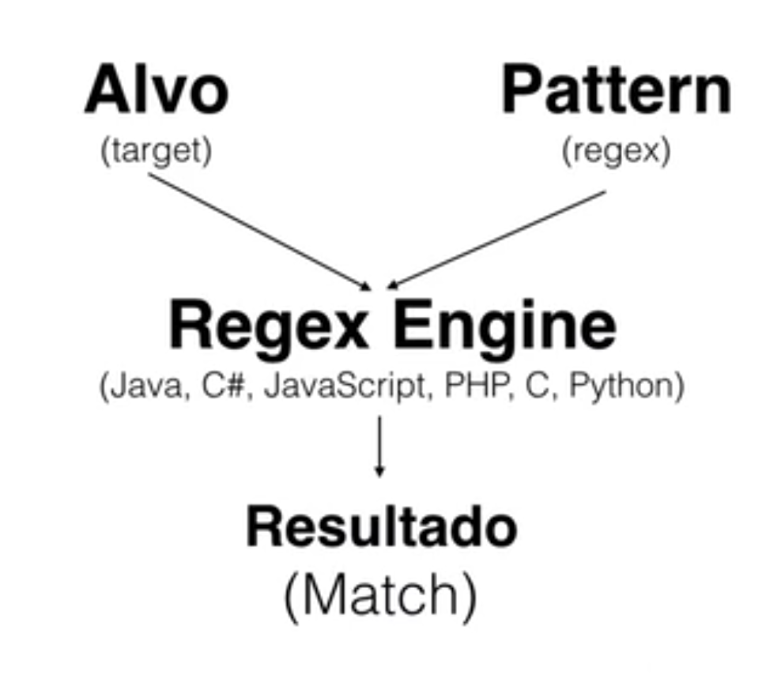

# Expressões Regulares (regex)

Expressões Regulares são padrões utilizados para selecionar combinações de caracteres em uma string.

Com elas podemos lidar com as seguintes situações:
- Procura;
- Substituição;
- Validação de formatos;
- Filtragem de informações.

Existem duas formas de declarar uma expressão regular:

- **Literal:** `/ab+c/` é lida quando o script é carregado e possui melhor performace;
- **Construtor do objeto RegExp:** `new RegExp('ab+c')` é realizada em tempo de execução. Use o construtor quando souber que o padrão da expressão regular irá mudar.

## Estrutura

Uma expressão regular é composta de âncoras, conjuntos de caracteres, quantificadores e flags.

/[ANCHOR] [CHARACTER SET] [QUANTIFIERS] [ANCHOR]/[FLAGS]

## Como funciona?

## Conhecendo os recursos

### Conjunto ou classes de caracteres

Corresponde a um caracter de um conjunto específico. Existem várias classes de caracteres predefinidas. Você também pode definir seus próprios conjuntos.

|Caractere|Nome|Descrição|
|:-|:-|:-|
|`[abc]`|character set|Corresponde a qualquer caractere do conjunto.|
|`[^abc]`|negated set|Corresponde a qualquer caractere que não esteja no conjunto.|
|`[a-z]`|range|Corresponde a um caractere entre os dois caracteres especificados, no nosso caso de `a` até `z` na tabela ASCII.|
|`[à-ü]`|range|Corresponde a um caractere entre os dois caracteres especificados, no nosso caso de `à` até `ü` na tabela ASCII.|
|`.`|dot|Corresponde a qualquer caractere, exceto quebras de linha. Equivalente a `[^\n\r]`.|
|`[\s\S]`|match any|Um conjunto de caracteres que pode ser usado para corresponder a qualquer caractere, incluindo quebras de linha.|
|`\w`|word char|Corresponde a qualquer caractere de palavra (alfanumérico e sublinhado). Equivalente a `[A-Za-z0-9_]`.|
|`\W`|not word char|Corresponde a qualquer caractere que não seja um caractere de palavra (alfanumérico e sublinhado). Equivalente a `[^A-Za-z0-9_]`.|
|`\d`|digit|Corresponde a qualquer caractere de dígito (0-9). Equivalente a `[0-9]`.|
|`\D`|not digit|Corresponde a qualquer caractere que não seja um caractere de dígito (0-9). Equivalente a `[^0-9]`.|
|`\s`|whitespace|Corresponde a qualquer caractere de espaço em branco (espaços, tabulações, quebras de linha).|
|`\S`|not whitespace|Corresponde a qualquer caractere que não seja um caractere de espaço em branco (espaços, tabulações, quebras de linha).|

### Quantificadores

Os quantificadores indicam que o token anterior deve ser correspondido um certo número de vezes. Por padrão, os quantificadores são gananciosos e corresponderão ao máximo de caracteres possível.

|Caractere|Nome|Descrição|
|:-|:-|:-|
|`*`|star|zero ou mais ocorrências, equivalente a `{0,}`.|
|`+`|plus|uma ou mais ocorrências, equivalente a `{1,}`.|
|`{m, n}`|quantifier|de `m` até `n` ou `{min, max}`.|
|`?`|optional|zero ou uma ocorrência, equivalente a `{0,1}`.|
|`?`|lazy|Torna o quantificador anterior lento, fazendo com que ele corresponda ao mínimo de caracteres possível.|
|&vert;|alternation / pipe|Atua como um operador `OR`.|

### Âncoras

As âncoras são únicas porque correspondem a uma posição dentro de uma string, não a um caractere.

|Caractere|Nome|Descrição|
|:-|:-|:-|
|`^`|beginning|Corresponde ao início de uma string.|
|`$`|end|Corresponde ao final de uma string.|
|`\b`|word boundary|Corresponde a uma posição de limite de palavra (início / fim da string).|
|`\B`|not word boundary|Corresponde a qualquer posição que não seja um limite de palavra. Isso corresponde a uma posição, não a um caracter.|

### Flags

Flags de expressão mudam como a expressão é interpretada. Flags seguem a barra de fechamento da expressão (ex.`/.+/igm`).

|Caractere|Nome|Descrição|
|:-|:-|:-|
|`g`|global|Encontra todas as correspondências em vez de parar após achar a primeira.|
|`i`|case insensitive|Case sensitive (ignora maiúsc./minúsc.)|
|`m`|multiline|Trata caracteres de início e fim (`^` e `$`) ao operar sobre múltiplas linhas (ou seja, corresponder o início ou fim de cada linha (delimitado por `\n` ou `\r`), e não apenas o começo ou fim de toda a string de entrada).|

## Grupos e referências

Os grupos permitem combinar uma sequência de tokens para operar juntos. Os grupos de captura podem ser referenciados por uma referência anterior e acessados separadamente nos resultados.

|Caractere|Nome|Descrição|
|:-|:-|:-|
|`(abc)`|capturing group|Agrupa vários tokens e cria um grupo de captura para extrair uma substring ou usar uma referência anterior.|
|`(?:abc)`|non-capturing group|Agrupa vários tokens sem criar um grupo de captura.|
|`\1`|numeric reference|Corresponde aos resultados de um grupo de captura. Por exemplo `\1` corresponde aos resultados do primeiro grupo de captura & `\3` corresponde ao terceiro.|

## Links relacionados

### Documentação auxiliar
- [MDN Web Docs - Expressões Regulares](https://developer.mozilla.org/pt-BR/docs/Web/JavaScript/Guide/Regular_Expressions)
- [MDN Web Docs - RegExp](https://developer.mozilla.org/pt-BR/docs/Web/JavaScript/Reference/Global_Objects/RegExp)

### Teste dua expressão regular
- [RegExr](https://regexr.com)
- [Rubular](https://rubular.com)
- [regex101](https://regex101.com)
- [Tabela ASCII](https://web.fe.up.pt/~ee96100/projecto/Tabela%20ascii.htm)
